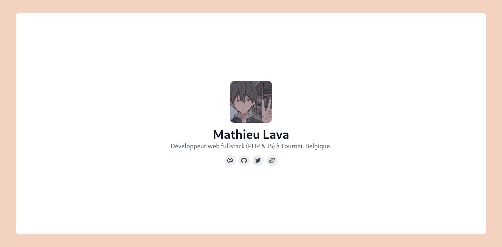

# mlava.dev



## post.md structure

```ts
---
title: exemple // Set the title of the post
date: 2022-07-12 // Set the date of the post
summary: "lorem ipsum" // Set the summary of the post, if not set, it will be generated from the content
cover: path/to/image // Set the cover image of the post
coverAlt: "lorem ipsum" // Set the alt of the cover image
ogImage: path/to/image // Set the og image of the post, if not set, it will be th cover image
tags: [deno, javascript, typescript] // Set the tags of the post
published: true // Set if the post is published or not
---
// Content
```
